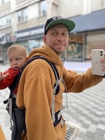

# **Aliaksei Rudak**



- **Location :** Almaty, Kazakhstan
- **Phone :** +7 (705) 150 03 01
- **Telegram :** +375 (29) 851 82 13
- **E-mail :** lexarudak@gmail.com
- **LinkedIN :** https://www.linkedin.com/feed/
- **GitHub :** https://github.com/lexarudak
- **Discord :** Aliaksei Rudak#3667

---

## **SUMMARY**

31 year old aspiring JavaScript Frontend developer with extensive sales experience. My work experience is not related to the IT field, but helped me acquire such important skills as:

- Ability to focus on completing a task
- Work under stress without loss of quality
- Break down a big task into separate steps and do it gradually, without panic and fuss
- Capture the essence of the customer's wishes
- Communicate in an understandable language with people of different status and qualifications

---

## **PROFESSIONAL EXPERIENCE**

### **DAR-electro** - Distributor of electrical equipment and smart home solutions

**February 2019 - March 2022** _Minsk, Belarus_

#### **Founder Assistant**

- Partners administration in the field of electrical equipment
- Creating price lists, reports, invoicing, issuing invoices
- Market analysis
- Meetings with customers, selection of equipment

### **Mesto gde svet** - Shop of lighting and electrical equipment

**February 2017 - January 2019** _Minsk, Belarus_

#### **Owner**

- Retail sales
- Bookkeeping
- Search and work with suppliers

### **Datastream DEP** - Distributor of equipment for local networks and video surveillance

**September 2014 - January 2017** _Minsk, Belarus_

#### **Specialist sales**

- B2B sales
- Equipment selection
- Participation in exhibitions

---

## **EDUCATION**

### **Belarusian State Academy of Communications** - _(Belarusian State College of Telecommunications)_

**September 2007 - June 2014** _Minsk, Belarus_

#### **Telecommunications engineer**

---

## **CODE EXAMPLE**

```
function multiply(a,b){
  return a * b;
}
```

---

## **WORK EXAMPLE**

### [**CV** - _(click to watch)_](https://github.com/lexarudak/rsschool-cv/blob/gh-pages/cv.md)

---

## **LANGUAGES**

- **Russian** - native
- **Belorussian** - native
- **English** - A2-B1 _(EnglishDom school studying)_
